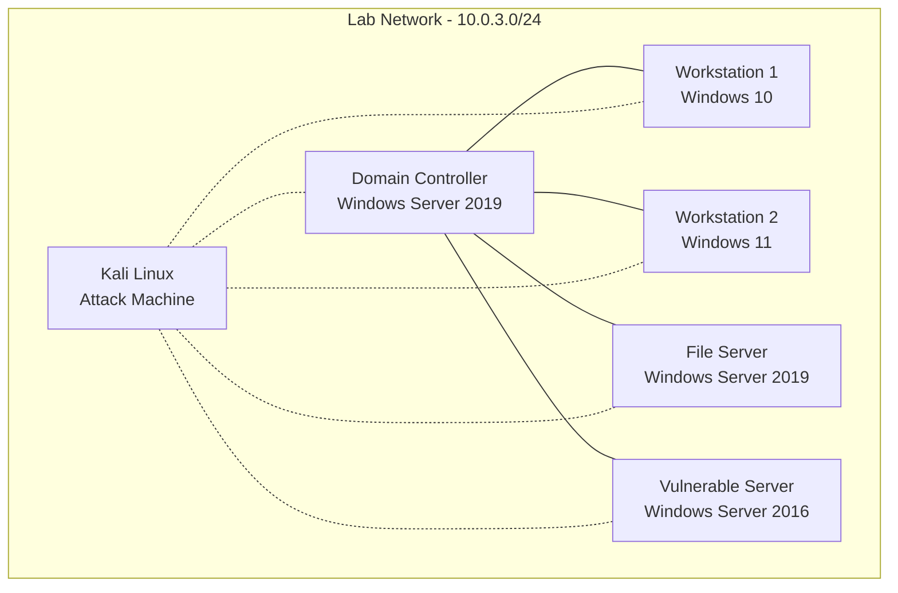

# Active Directory - Kali Lab

!!! note "Overview"

    Environment based on attacking vulnerable Windows Domain Controller and user machines.

=== "Kali based tools"

    * nmap
    * burp suite
    * JackTheRipper

### Environment Components

!!! note "Connectivity details"

    Kali had access to internet - AD LAB
    AD Lab including DC only had internal LAN access, no external access.

## Domain Infrastructure

- **Domain Name**: MARVEL
- **Forest/Domain Functional Level**: Windows Server 2016
- **Domain Controller**: Windows Server 2019
  - Roles: AD DS, DNS, DHCP

=== "Client systems"

    | System    | OS             | IP         | Purpose          |
    | --------- | -------------- | ---------- | ---------------- |
    | Punisher  | Windows 10 Pro | 10.0.3.100 | User workstation |
    | Spiderman | Windows 10 Pro | 10.0.3.101 | User workstation |

=== "Server systems"

    | System            | OS                  | IP        | Purpose                     |
    | ----------------- | ------------------- | --------- | --------------------------- |
    | Domain Controller | Windows Server 2019 | 10.0.3.10 | File shares, sensitive data 

---

*Return to [Home](../index.md)*  
*Return to [Infrastructure](index.md)*  
*Return to [Homelab](../homelab/index.md)*