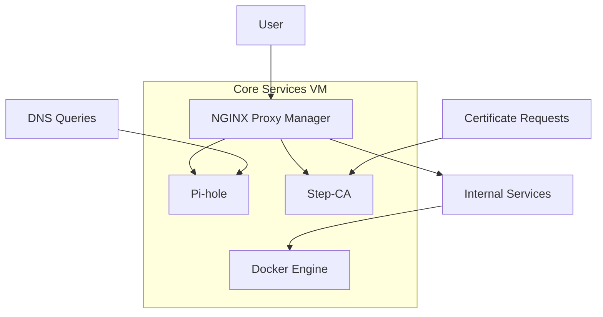

# Core Infrastructure Services

## Overview

*Requests are sent through Pihole first for DNS resolution. These internal services are then passed through Nginx Proxy Manager for SSL secured port forwarding. These SSL certificate are generated from Step-ca and stored in a hardened Alpine Docker LXC.*

## Service Architecture

## DNS Management: Pi-hole

### Implementation Details

- **Deployment**: *Linux Containers (LXC*)
- **Configuration Highlights**:
    - Custom blocklists for enhanced security
    - Local DNS overrides for internal services

### Security Features

- DNS filtering capabilities
- Blocking of known malicious domains
- Telemetry and advertising domain blocking

### Monitoring and Management

- Admin dashboard access method
- Alerting configuration
- Performance statistics

## Reverse Proxy: NGINX Proxy Manager

### Implementation Details

- **Deployment**: *Linux Containers (LXC*)
- **Key Features**:
    - SSL termination
    - Internal service routing
    - Access control

### Security Configuration

- Certificate management from step-ca (link to step-ca page)
- IP and geolocation restrictions
- Authentication requirements

### Proxy Rules

| Service | Internal Address | External Path | Access Controls |
| ------- | ---------------- | ------------- | --------------- |
| Pi-hole | 10.0.1.10:80     | pihole.lab    | Admin VLAN only |
| Proxmox | 10.0.1.5:8006    | proxmox.lab   | Admin VLAN, 2FA |

## Certificate Authority: Step-CA

*Honestly, I am probably using only 1% of the actual capabilities of step-ca--but for now it's working as a SSL/SSH generator as part of the PKI of this homelab.*

### Implementation Details

- **Deployment**: *Docker LXC*

- **Key Components**:
    - Root CA configuration
    - Intermediate CAs in use for easy rotation as needed