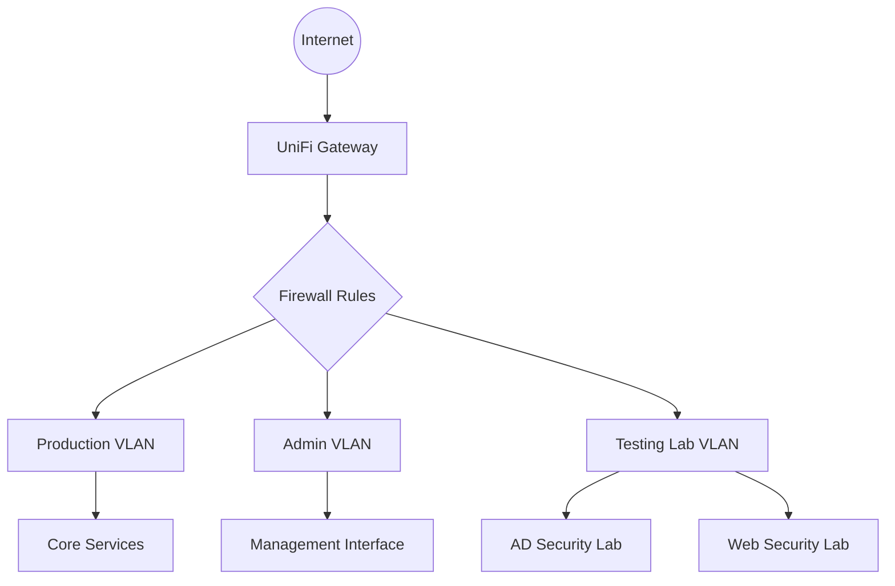

# Network Infrastructure

## Overview

*Brief description of your overall network design philosophy, emphasizing security through segmentation.*

## Network Topology

## Network Segmentation

| VLAN       | IP Range    | Purpose                      | Security Controls                                            |
| ---------- | ----------- | ---------------------------- | ------------------------------------------------------------ |
| Production | 10.0.1.0/24 | Core infrastructure services | • Strict firewall rules • Limited external access • Service isolation |
| Admin      | 10.0.2.0/24 | Management access            | • Admin-only access • Restricted to authorized devices • Enhanced authentication |
| Lab        | 10.0.3.0/24 | Security testing environment | • Completely isolated • No internet access • Sandboxed environment |

## Network Equipment

### Primary Devices

- **Gateway**: UniFi Security Gateway
- **Switch**: UniFi Switch
- **Access Points**: UniFi AP AC Pro
- **Management**: UniFi Controller (hosted on Core Services VM)

### Network Services

- **DHCP**: Isolated per VLAN with strict addressing
- **DNS**: Pi-hole with custom filtering rules
- **Firewall**: VLAN isolation with strict inter-VLAN policies

## Security Measures

### Traffic Filtering

*Detail your approach to traffic filtering, including:*

- DNS-level filtering with Pi-hole
- Application-level filtering
- Intrusion detection/prevention capabilities

### Network Monitoring

*Describe how you monitor network traffic, detect anomalies, and maintain visibility*

### Authentication

*Explain network access controls, including:*

- Certificate-based authentication using Step-CA
- Network access policies
- Device authorization procedures

## Routing Architecture

*Detail how traffic is routed between segments, including security considerations*

## Future Enhancements

- IDS/IPS implementation
- Enhanced network monitoring
- Traffic analysis capabilities