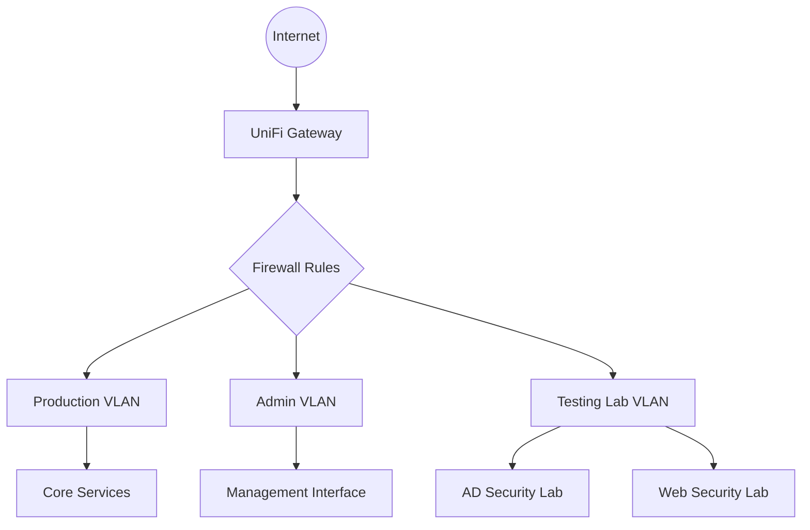

# VLAN Infrastructure

## Overview

Separate the virtualized testing environment and use Kali as the pivot point.

!!! note "Overview"

    Unifi UI makes this straightforward and highly configurable. 
    
    Some abstraction applied to the topology below.

## Network Topology

## Network Segmentation

| VLAN       | IP Range    | Purpose                      | Security Controls                                            |
| ---------- | ----------- | ---------------------------- | ------------------------------------------------------------ |
| Production | 10.0.1.0/24 | Core infrastructure services | • Strict firewall rules • Limited external access • Service isolation |
| Admin      | 10.0.2.0/24 | Management access            | • Admin-only access • Restricted to authorized devices • Enhanced authentication |
| Lab        | 10.0.3.0/24 | Security testing environment | • Completely isolated • No internet access • Sandboxed environment |
