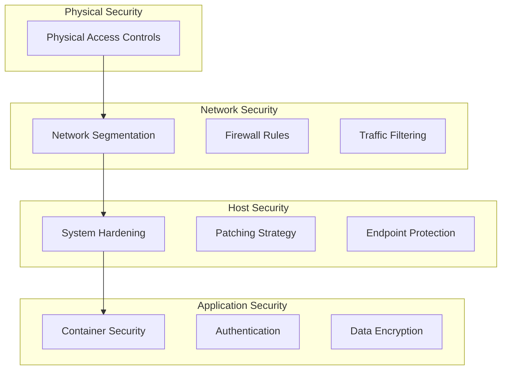

# Security Architecture

## Overview

*Brief description of your overall security approach and design philosophy for your homelab.*

## Defense-in-Depth Strategy

## Network Security Controls

### Segmentation Implementation

*Detail how your network segmentation is implemented*

- VLAN configuration
- Inter-VLAN routing restrictions
- Security zone definition

### Firewall Policy

*Describe your firewall policy philosophy*

- Default-deny approach
- Service-specific rule structure
- Management and auditing

### Traffic Filtering

*Explain your traffic inspection and filtering mechanisms*

- DNS-level filtering with Pi-hole
- Application-level filtering
- Deep packet inspection capabilities

## System Security

### Virtualization Security

*Describe security measures for your Proxmox environment*

- Hypervisor hardening
- VM isolation
- Resource segregation

### Operating System Hardening

*Detail your approach to system hardening*

- Minimal installation principles
- Service restriction
- User and privilege management

### Patch Management

*Explain your patching strategy*

- Update cadence
- Testing procedures
- Rollback capabilities

## Authentication & Identity

### Certificate Infrastructure

*Describe your PKI implementation with Step-CA*

- Certificate lifecycle management
- Client authentication
- Service authentication

### Access Control Model

*Explain your access control approach*

- Principle of least privilege
- Role-based access control
- Privilege separation

## Data Protection

### Encryption Strategy

*Detail your encryption approach*

- Data at rest encryption
- Data in transit encryption
- Key management

### Backup Security

*Describe security measures for backups*

- Encryption of backup data
- Access controls for backups
- Integrity verification

## Security Testing & Validation

### Testing Methodology

*Explain how you validate your security measures*

- Security scanning approach
- Vulnerability assessment
- Configuration validation

### Isolation of Testing Environment

*Detail how your testing environments are isolated*

- Lab network containment
- Attack surface limitation
- Data segregation

## Incident Response Capabilities

### Monitoring Strategy

*Describe your security monitoring approach*

- Log collection and analysis
- Alerting configuration
- Visibility tools

### Response Playbooks

*Outline your approach to security incidents*

- Detection capabilities
- Containment procedures
- Recovery process