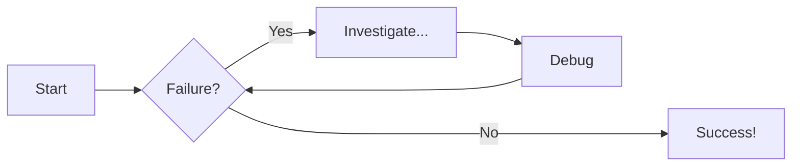
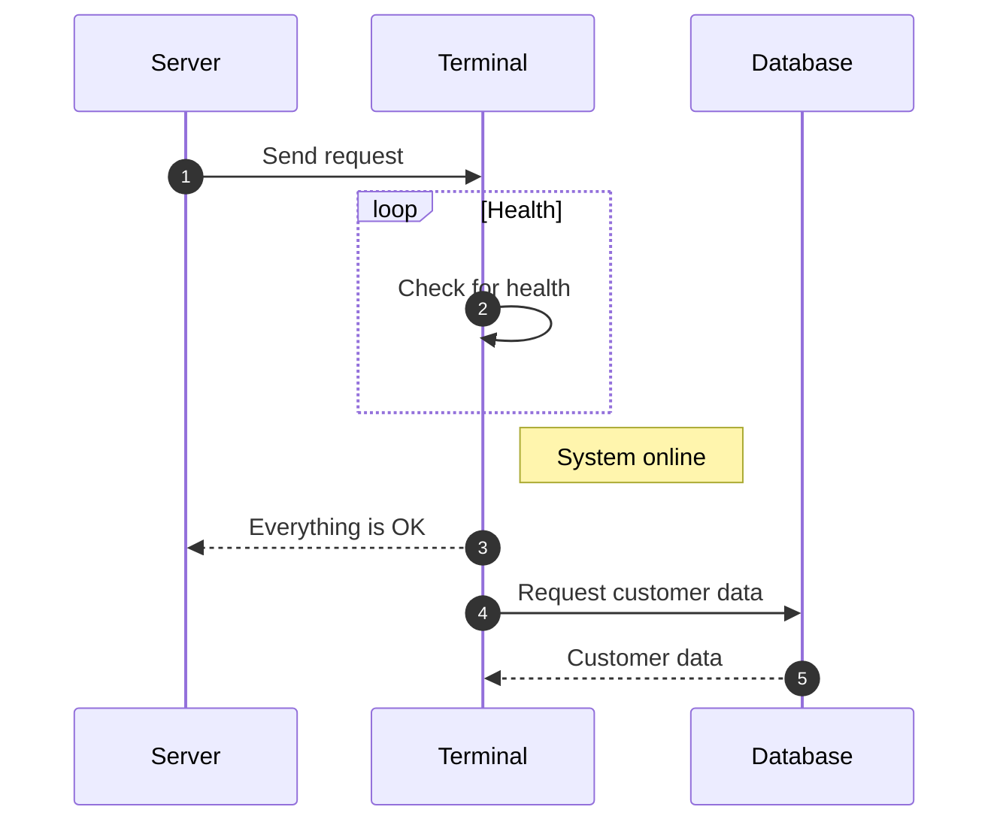
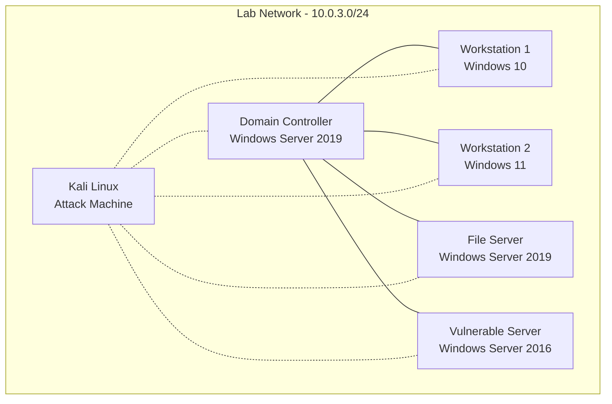

# Diagram Examples

## Flowcharts

AND THIS:

## Sequence Diagrams

AND THIS:

## Environment Components

## Domain Infrastructure

- **Domain Name**: MARVEL
- **Forest/Domain Functional Level**: Windows Server 2016
- **Domain Controller**: Windows Server 2019
  - Roles: AD DS, DNS, DHCP

## Client Systems

| System    | OS             | IP         | Purpose          |
| --------- | -------------- | ---------- | ---------------- |
| Punisher  | Windows 10 Pro | 10.0.3.100 | User workstation |
| Spiderman | Windows 10 Pro | 10.0.3.101 | User workstation |

## Server Systems

| System            | OS                  | IP        | Purpose                     |
| ----------------- | ------------------- | --------- | --------------------------- |
| Domain Controller | Windows Server 2019 | 10.0.3.10 | File shares, sensitive data |
